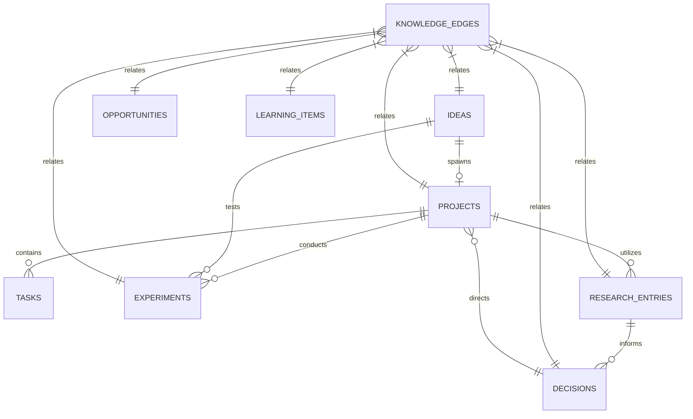

# Data Model & Schema Documentation

## 1. Relational Architecture

The Personal Command Center runs on SQLite 3.50+ using relational tables with foreign keys and JSON support.

---

## 2. Table Definitions

### 2.1 `tasks`
- `id` (TEXT PRIMARY KEY)
- `title` (TEXT NOT NULL)
- `project_id` (TEXT REFERENCES projects(id) ON DELETE SET NULL)
- `status` (TEXT NOT NULL DEFAULT 'todo') CHECK: `todo`, `in_progress`, `blocked`, `completed`
- `priority` (TEXT NOT NULL DEFAULT 'p2_medium') CHECK: `p0_critical`, `p1_high`, `p2_medium`, `p3_low`
- `deadline` (TEXT)
- `scheduled_date` (TEXT)
- `blocker_reason` (TEXT)
- `energy_level` (TEXT DEFAULT 'deep_work') CHECK: `deep_work`, `quick_win`, `administrative`
- `tags` (TEXT DEFAULT '[]') -- JSON array of strings
- `created_at` (TEXT NOT NULL)
- `updated_at` (TEXT NOT NULL)
- `completed_at` (TEXT)

### 2.2 `projects`
- `id` (TEXT PRIMARY KEY)
- `title` (TEXT NOT NULL)
- `description` (TEXT)
- `category` (TEXT NOT NULL DEFAULT 'ai_systems') CHECK: `ai_systems`, `research`, `product`, `career`, `infrastructure`
- `status` (TEXT NOT NULL DEFAULT 'active') CHECK: `active`, `planned`, `completed`, `blocked`, `maintenance`
- `health` (TEXT NOT NULL DEFAULT 'green') CHECK: `green`, `yellow`, `red`
- `progress_pct` (INTEGER NOT NULL DEFAULT 0)
- `next_actions` (TEXT DEFAULT '[]') -- JSON array of strings
- `target_date` (TEXT)
- `created_at` (TEXT NOT NULL)
- `updated_at` (TEXT NOT NULL)

### 2.3 `ideas`
- `id` (TEXT PRIMARY KEY)
- `title` (TEXT NOT NULL)
- `description` (TEXT)
- `category` (TEXT NOT NULL DEFAULT 'software') CHECK: `software`, `research`, `venture`, `content`, `personal`
- `origin` (TEXT)
- `status` (TEXT NOT NULL DEFAULT 'captured') CHECK: `captured`, `explored`, `validated`, `planned`, `executing`, `completed`, `abandoned`
- `priority` (TEXT NOT NULL DEFAULT 'medium') CHECK: `high`, `medium`, `low`
- `next_action` (TEXT)
- `related_project_id` (TEXT REFERENCES projects(id) ON DELETE SET NULL)
- `created_at` (TEXT NOT NULL)
- `updated_at` (TEXT NOT NULL)
- `status_changed_at` (TEXT NOT NULL)

### 2.4 `experiments`
- `id` (TEXT PRIMARY KEY)
- `idea_id` (TEXT REFERENCES ideas(id) ON DELETE SET NULL)
- `project_id` (TEXT REFERENCES projects(id) ON DELETE SET NULL)
- `title` (TEXT NOT NULL)
- `hypothesis` (TEXT NOT NULL)
- `objective` (TEXT NOT NULL)
- `assumptions` (TEXT DEFAULT '[]') -- JSON array
- `experiment_design` (TEXT NOT NULL)
- `expected_result` (TEXT NOT NULL)
- `actual_result` (TEXT)
- `evidence` (TEXT)
- `conclusion` (TEXT)
- `next_step` (TEXT)
- `status` (TEXT NOT NULL DEFAULT 'hypothesis') CHECK: `hypothesis`, `design`, `running`, `analyzing`, `concluded`, `aborted`
- `created_at` (TEXT NOT NULL)
- `updated_at` (TEXT NOT NULL)

### 2.5 `decisions`
- `id` (TEXT PRIMARY KEY)
- `title` (TEXT NOT NULL)
- `date` (TEXT NOT NULL)
- `context` (TEXT NOT NULL)
- `alternatives_considered` (TEXT DEFAULT '[]') -- JSON array of {option, pros, cons}
- `assumptions` (TEXT NOT NULL)
- `evidence` (TEXT NOT NULL)
- `expected_outcome` (TEXT NOT NULL)
- `actual_outcome` (TEXT)
- `confidence_level` (INTEGER NOT NULL DEFAULT 75)
- `lessons_learned` (TEXT)
- `status` (TEXT NOT NULL DEFAULT 'pending_review') CHECK: `pending_review`, `reviewed`, `superseded`
- `review_date` (TEXT)
- `created_at` (TEXT NOT NULL)
- `updated_at` (TEXT NOT NULL)

### 2.6 `research_entries`
- `id` (TEXT PRIMARY KEY)
- `research_question` (TEXT NOT NULL)
- `topic` (TEXT NOT NULL)
- `status` (TEXT NOT NULL DEFAULT 'exploring') CHECK: `exploring`, `synthesizing`, `concluded`, `dormant`
- `investigations` (TEXT)
- `findings` (TEXT DEFAULT '[]') -- JSON array of {claim, evidence, confidence}
- `sources` (TEXT DEFAULT '[]') -- JSON array of {title, url_or_citation, type}
- `conclusions` (TEXT)
- `unresolved_questions` (TEXT DEFAULT '[]') -- JSON array
- `related_project_id` (TEXT REFERENCES projects(id) ON DELETE SET NULL)
- `created_at` (TEXT NOT NULL)
- `updated_at` (TEXT NOT NULL)

### 2.7 `learning_items`
- `id` (TEXT PRIMARY KEY)
- `subject` (TEXT NOT NULL)
- `title` (TEXT NOT NULL)
- `type` (TEXT NOT NULL DEFAULT 'book') CHECK: `book`, `course`, `paper`, `tutorial`, `topic`
- `progress_pct` (INTEGER NOT NULL DEFAULT 0)
- `status` (TEXT NOT NULL DEFAULT 'active') CHECK: `queued`, `active`, `paused`, `completed`
- `notes` (TEXT)
- `practical_exercises` (TEXT DEFAULT '[]') -- JSON array of {title, completed}
- `key_takeaways` (TEXT)
- `created_at` (TEXT NOT NULL)
- `updated_at` (TEXT NOT NULL)

### 2.8 `opportunities`
- `id` (TEXT PRIMARY KEY)
- `title` (TEXT NOT NULL)
- `description` (TEXT)
- `source` (TEXT)
- `date_discovered` (TEXT NOT NULL)
- `category` (TEXT NOT NULL) CHECK: `technology`, `career`, `business`, `entrepreneurship`, `education`, `investment`, `consulting`, `partnerships`, `emerging_markets`
- `potential_upside` (TEXT)
- `requirements` (TEXT)
- `risks` (TEXT)
- `status` (TEXT NOT NULL DEFAULT 'evaluating') CHECK: `evaluating`, `pursuing`, `watching`, `archived`
- `next_action` (TEXT)
- `created_at` (TEXT NOT NULL)
- `updated_at` (TEXT NOT NULL)

### 2.9 `knowledge_edges`
- `id` (TEXT PRIMARY KEY)
- `source_type` (TEXT NOT NULL)
- `source_id` (TEXT NOT NULL)
- `target_type` (TEXT NOT NULL)
- `target_id` (TEXT NOT NULL)
- `relation_type` (TEXT NOT NULL) CHECK: `leads_to`, `validates`, `informs`, `implements`, `spawns`, `depends_on`, `references`
- `notes` (TEXT)
- `created_at` (TEXT NOT NULL)
