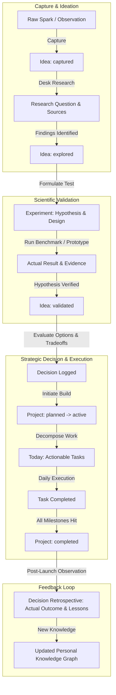

# Product Specification: Personal Command Center (Personal OS)

**Author:** Antigravity Systems Architect & Product Strategist  
**Target Platform:** Web / Desktop HUD / Local-First Python & SQLite Runtime  
**Status:** Approved for Implementation  
**Version:** 1.0.0-PROD  

---

## 1. The Problem Being Solved

In the modern AI and accelerated technology landscape, knowledge workers, researchers, engineers, and founders suffer from **cognitive fragmentation and intelligence decay**:
- **Scattered Information Silos**: Tasks reside in task managers, technical musings in note apps, code in repositories, bookmarks in browsers, decisions in Slack or heads, and research papers in folders.
- **Passive Logging vs. Situational Awareness**: Most personal productivity apps are passive CRUD tables (to-do lists or note trees) that do not synthesize connections between what someone is *learning*, what they are *researching*, what *decisions* they made, and what *projects* they are actively executing.
- **Decision Amnesia**: High-stakes technical and career choices are made based on unrecorded assumptions. Months later, when outcomes materialize, there is no retrospective audit trail to evaluate whether judgment was calibrated.
- **Idea Graves & Unexecuted Hypotheses**: Ideas are captured in bursts, never validated, never transformed into structured experiments, and eventually lost.
- **Superficial "AI Features"**: Typical AI additions are trivial chatbot wrappers with no grounding in the user's ground-truth state, leading to hallucinations and vanity summaries.

**The Solution:** The **Personal Command Center (Personal OS)** is an integrated operating system designed for an individual human being operating at high velocity in the AI era. It transforms scattered data points into **continuous situational awareness and actionable intelligence**.

---

## 2. The Target User

**Primary Persona:** The High-Velocity AI Engineer / Research Scientist / Technical Founder.
- **Profile:** Damilola Adegunwa (or similar technical builder).
- **Environment:** Multi-project juggling (open-source repos, machine learning research, consulting, career growth, investment research).
- **Behavioral Attributes:**
  - High idea velocity, multiple learning tracks simultaneously.
  - Demands keyboard-driven speed, high information density, and low latency.
  - Distrusts "black-box" magic; values grounded, verifiable facts over generative fluff.
  - Requires clear causal links: *Why am I doing this task? Which project does it advance? What experiment validates this hypothesis?*

---

## 3. Core Use Cases

| UC ID | Use Case Name | Description | Key Actors / Triggers |
|---|---|---|---|
| **UC-01** | **Tactical Morning Briefing** | User opens Command Center at 08:00. System analyzes deadlines, blockers, stalled projects, and urgent actions to generate a grounded Daily Briefing. | User / Daily Cron / Hotkey `B` |
| **UC-02** | **Idea-to-Experiment Pipeline** | User captures a raw concept, moves it to `explored`, links supporting research, formulates a formal hypothesis, and launches an experiment. | User / Hotkey `C` (Quick Capture) |
| **UC-03** | **Decision Journaling & Retrospective** | User logs an architectural or strategic decision with explicit assumptions, confidence score, and expected outcome. Later, user logs actual outcome for retrospective analysis. | User / Strategic review |
| **UC-04** | **Personal Knowledge Graph Traversal** | Visualizing how a research paper connects to a finding, which informed a decision, which triggered a project, which resulted in an open-source artifact. | Visual Graph Explorer |
| **UC-05** | **Opportunity Radar Evaluation** | Capturing market, technology, or career opportunities, scoring upside vs. risk, and tracking next exploratory actions. | Radar Dashboard |
| **UC-06** | **Weekly Retrospective & Reset** | End-of-week AI synthesis highlighting completed milestones, recurring blockers, learning velocity, and neglected priorities. | Weekly Review Module |
| **UC-07** | **Universal Omni-Search** | Instantaneous multi-entity retrieval across tasks, projects, ideas, decisions, research, learning, and opportunities via `Cmd+K`. | Global Hotkey `Cmd+K` / `/` |

---

## 4. Information Architecture (IA)

The application follows a HUD-style single-page architecture with a persistent Command Sidebar, Top Tactical Bar, Central Viewport, and Contextual Slide-Over Drawer:

```
+---------------------------------------------------------------------------------------------------+
|  [LOGO] PERSONAL COMMAND CENTER  | [Search Cmd+K] | [Live Time UTC+1] [Active: 6 | Blocked: 2] [C: New] |
+---------------------------------------------------------------------------------------------------+
|  SIDEBAR NAV       |  CENTRAL VIEWPORT (High-Density Responsive Grid)                            |
|                    |                                                                             |
|  * TODAY (Cockpit) |  +-----------------------+ +-----------------------+ +--------------------+ |
|  * PROJECTS        |  | TODAY'S PRIORITIES    | | ACTIVE DEADLINES      | | BLOCKED & RISKS    | |
|  * IDEAS           |  | - Complete GPU eval   | | - NeurIPS Draft (3d)  | | - Waiting on AWS   | |
|  * EXPERIMENTS     |  | - Review RFC 104      | | - Q3 Tax Filing (7d)  | | - H100 quota limit | |
|  * DECISIONS       |  +-----------------------+ +-----------------------+ +--------------------+ |
|  * RESEARCH        |                                                                             |
|  * LEARNING        |  +-------------------------------------+ +--------------------------------+ |
|  * OPPORTUNITY     |  | ACTIVE PROJECTS STATUS MATRIX       | | QUICK ACTION / AI BRIEFING     | |
|  * KNOWLEDGE GRAPH |  | [Project A - Green - 82%]           | | Grounded tactical digest       | |
|  * SEARCH          |  | [Project B - Yellow - 45%]          | | [FACT] 3 tasks overdue         | |
|  * AI STUDIO       |  | [Project C - Red - 15%]             | | [REC] Unblock GPU quota        | |
|  * METRICS         |  +-------------------------------------+ +--------------------------------+ |
+--------------------+-----------------------------------------------------------------------------+
```

---

## 5. Domain Model

### 5.1 Primary Entities

1. **Task / Commitment (`tasks`)**:
   - `id`: UUID
   - `title`: String (concise imperative)
   - `project_id`: Optional FK to Project
   - `status`: `todo` | `in_progress` | `blocked` | `completed`
   - `priority`: `p0_critical` | `p1_high` | `p2_medium` | `p3_low`
   - `deadline`: ISO Datetime
   - `scheduled_date`: ISO Date
   - `blocker_reason`: Optional String (if `blocked`)
   - `energy_level`: `deep_work` | `quick_win` | `administrative`
   - `tags`: List of Strings
   - `created_at`, `updated_at`, `completed_at`

2. **Project (`projects`)**:
   - `id`: UUID
   - `title`: String
   - `description`: Text
   - `category`: `ai_systems` | `research` | `product` | `career` | `infrastructure`
   - `status`: `active` | `planned` | `completed` | `blocked` | `maintenance`
   - `health`: `green` | `yellow` | `red`
   - `progress_pct`: Integer (0-100)
   - `next_actions`: List of Strings
   - `target_date`: ISO Date
   - `created_at`, `updated_at`

3. **Idea (`ideas`)**:
   - `id`: UUID
   - `title`: String
   - `description`: Text
   - `category`: `software` | `research` | `venture` | `content` | `personal`
   - `origin`: String (where/how it came to mind)
   - `status`: `captured` | `explored` | `validated` | `planned` | `executing` | `completed` | `abandoned`
   - `priority`: `high` | `medium` | `low`
   - `next_action`: String
   - `related_project_id`: Optional FK
   - `timestamps`: `created_at`, `updated_at`, `status_changed_at`

4. **Experiment (`experiments`)**:
   - `id`: UUID
   - `idea_id`: Optional FK
   - `project_id`: Optional FK
   - `title`: String
   - `hypothesis`: Text ("If we implement X, then Y will occur because Z")
   - `objective`: Text
   - `assumptions`: List of Strings
   - `experiment_design`: Text (methodology, test harness, sample size)
   - `expected_result`: Text
   - `actual_result`: Optional Text
   - `evidence`: Optional Text (quantitative metrics, logs, benchmarks)
   - `conclusion`: Optional Text
   - `next_step`: Optional Text
   - `status`: `hypothesis` | `design` | `running` | `analyzing` | `concluded` | `aborted`
   - `created_at`, `updated_at`

5. **Decision Log (`decisions`)**:
   - `id`: UUID
   - `title`: String (concise statement of choice)
   - `date`: ISO Date
   - `context`: Text (driving forces, constraints, urgency)
   - `alternatives_considered`: JSON Array of `{option: string, pros: string, cons: string}`
   - `assumptions`: Text
   - `evidence`: Text
   - `expected_outcome`: Text
   - `actual_outcome`: Optional Text
   - `confidence_level`: Integer (1-100)
   - `lessons_learned`: Optional Text
   - `status`: `pending_review` | `reviewed` | `superseded`
   - `review_date`: ISO Date (when to review outcome)
   - `created_at`, `updated_at`

6. **Research Dossier (`research_entries`)**:
   - `id`: UUID
   - `research_question`: String ("Can speculative decoding achieve 2.5x throughput on Apple Silicon?")
   - `topic`: String
   - `status`: `exploring` | `synthesizing` | `concluded` | `dormant`
   - `investigations`: Text
   - `findings`: JSON Array of `{claim: string, evidence: string, confidence: string}`
   - `sources`: JSON Array of `{title: string, url_or_citation: string, type: string}`
   - `conclusions`: Text
   - `unresolved_questions`: List of Strings
   - `related_project_id`: Optional FK
   - `created_at`, `updated_at`

7. **Learning Tracker (`learning_items`)**:
   - `id`: UUID
   - `subject`: String
   - `title`: String
   - `type`: `book` | `course` | `paper` | `tutorial` | `topic`
   - `progress_pct`: Integer (0-100)
   - `status`: `queued` | `active` | `paused` | `completed`
   - `notes`: Text
   - `practical_exercises`: JSON Array of `{title: string, completed: boolean}`
   - `key_takeaways`: Text
   - `created_at`, `updated_at`

8. **Opportunity Radar (`opportunities`)**:
   - `id`: UUID
   - `title`: String
   - `description`: Text
   - `source`: String
   - `date_discovered`: ISO Date
   - `category`: `technology` | `career` | `business` | `entrepreneurship` | `education` | `investment` | `consulting` | `partnerships` | `emerging_markets`
   - `potential_upside`: Text
   - `requirements`: Text
   - `risks`: Text
   - `status`: `evaluating` | `pursuing` | `watching` | `archived`
   - `next_action`: Text
   - `created_at`, `updated_at`

9. **Knowledge Edge (`knowledge_edges`)**:
   - `id`: UUID
   - `source_type`: String (`idea`, `project`, `research`, `decision`, `experiment`, `learning`, `opportunity`)
   - `source_id`: UUID
   - `target_type`: String
   - `target_id`: UUID
   - `relation_type`: `leads_to` | `validates` | `informs` | `implements` | `spawns` | `depends_on` | `references`
   - `notes`: Optional String

---

## 6. User Workflows



---

## 7. Dashboard Design & Visual Ergonomics

- **Aesthetic Direction:** **Tactical HUD / Bloomberg-grade command deck**. Dark charcoal (`#090d16` background, `#121826` surface panels, `#1e293b` borders) with deliberate semantic accents:
  - **Cyan/Sky (`#38bdf8`)**: Information, active focal points.
  - **Emerald (`#34d399`)**: Health green, completed milestones, verified findings.
  - **Amber (`#fbbf24`)**: Warning, stalled projects, approaching deadlines.
  - **Rose (`#f87171`)**: Critical blockers, P0 emergencies, failed hypotheses.
  - **Violet (`#a78bfa`)**: Grounded AI intelligence, synthesis callouts.
- **Key Ergonomic Controls:**
  - `Cmd+K` or `/`: Opens Omni-Search palette.
  - `C`: Opens Universal Quick Capture drawer.
  - `B`: Triggers Instant Grounded Daily Briefing modal.
  - `1` through `9`: Quick tab switching across views.

---

## 8. AI Opportunities & Grounding Rules

### Grounding Principles
The Command Center strictly enforces a **Zero-Hallucination Grounding Taxonomy**:
1. Every piece of text generated by the AI layer is categorized into four explicit brackets:
   - `[FACT]`: Direct ground-truth extracted from database records (e.g., "Project X was updated 16 days ago").
   - `[USER CONTEXT]`: User's explicit statements, notes, or rationale (e.g., "User stated goal is sub-50ms latency").
   - `[ASSUMPTION]`: Unverified premise or risk requiring validation.
   - `[AI RECOMMENDATION]`: Agentic suggestion or proposed tactical maneuver.
2. If an entity field is empty, the AI must explicitly flag `Missing information in record` rather than fabricating plausible answers.

### Core AI Capabilities
- **Daily Briefing**: Contextual situational synthesis.
- **Weekly Review**: Velocity, blockers, and learning pace retrospective.
- **Project Diagnostic**: Identifies stalled initiatives, missing criteria, and bottleneck dependencies.
- **Idea Evaluation Engine**: Adversarial critique, failure mode analysis, and hypothesis formulation.
- **Decision Retrospective**: Post-mortem comparing expected vs. actual outcomes to calculate decision calibration.

---

## 9. Search Strategy

- **Universal Multi-Entity Indexing**: Unified query across Tasks, Projects, Ideas, Experiments, Decisions, Research, Learning, and Opportunities.
- **Token Match & Multi-Facet Filtering**:
  - Text matching across `title`, `description`, `context`, `tags`, and `notes`.
  - Faceted filters: Type (`project`, `idea`, etc.), Status (`active`, `blocked`, etc.), Priority (`p0`..`p3`), Date Window.
  - Graph Neighbor Filter: Ability to query "all entities connected to Project X".

---

## 10. Data Lifecycle

```
[QUICK CAPTURE]  -->  [INBOX / UNTRIAGED]
                             |
                             v
                 [REFINED & CATEGORIZED] (Idea / Task / Research / Opportunity)
                             |
                             v
                 [LINKED TO GRAPH] (Explicit edges established)
                             |
                             v
                 [ACTIVE EXECUTION] (Daily tasks, running experiments, tracking projects)
                             |
                             v
                 [OUTCOME / RETROSPECTIVE] (Decision outcomes recorded, lessons logged)
                             |
                             v
                 [ARCHIVED / PERPETUAL KNOWLEDGE] (Persisted in SQLite & Knowledge Graph)
```

---

## 11. Automation Opportunities

- **Automated Health Degradation**: If an active project has zero task activity for >14 days, flag status to `stale/yellow`.
- **Decision Review Alerts**: Automatically surface decisions whose `review_date` has arrived into the Today view.
- **Blocker Escalation**: Automatically elevate blocked tasks attached to P0 projects into the top daily alert panel.
- **Automated Knowledge Graph Linkage**: Proactively suggest edges when an idea references a research topic by keyword.

---

## 12. Future Extensibility

- **Model Context Protocol (MCP)**: Expose Command Center state as an MCP server so external AI tools (Claude, Cursor, Antigravity subagents) can query priorities or record findings.
- **Local Calendar & Git Watchers**: Bi-directional synchronization with local git commits to automatically log project activity.
- **Vector Embeddings**: Augment SQLite FTS with local sqlite-vec embeddings for conceptual semantic similarity.
