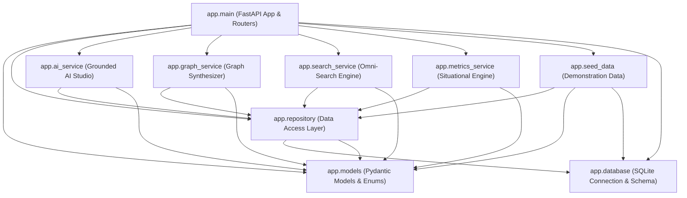
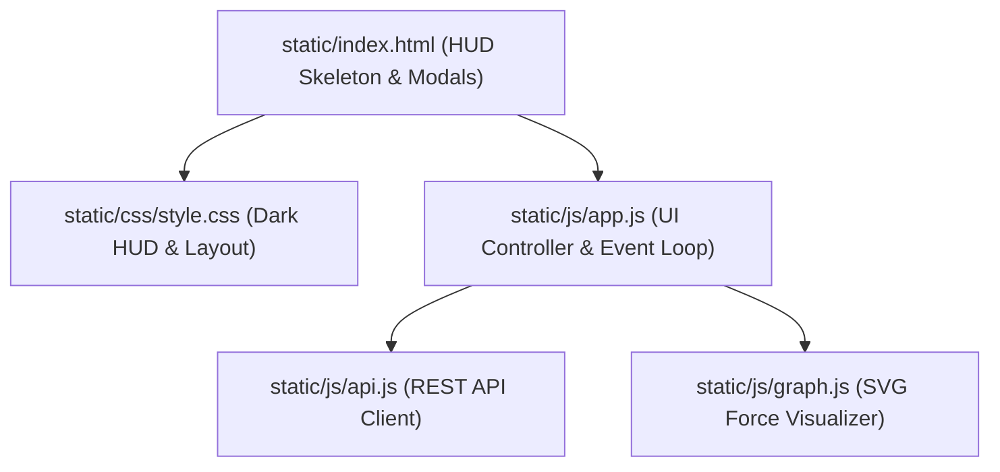

# Component Architecture Specification

This document provides a detailed structural breakdown of all software components in the **Personal Command Center**.

---

## 1. Component Dependency Graph



---

## 2. Backend Component Specifications

### 2.1 `app.main` (Application Controller & Routing Layer)
- **Role:** Defines the central FastAPI application instance, registers CORS middleware, configures the `@asynccontextmanager` application lifespan, mounts static directory assets, and exposes 24 HTTP REST endpoints.
- **Key Responsibilities:**
  - Coordinates startup tasks (`init_db()`, `seed_database()`).
  - Serializes domain model responses via Pydantic response models.
  - Maps domain exceptions to standard HTTP status codes (`HTTPException(404)`).
  - Routes traffic to appropriate domain services.

### 2.2 `app.database` (Connection Manager & Schema DDL)
- **Role:** Centralized SQLite connection factory and schema migration runner.
- **Key Responsibilities:**
  - Resolves database file path via `os.getenv("COMMAND_CENTER_DB")` or falls back to `personal_os.db` in project root.
  - Configures SQLite connection pragmas:
    ```python
    conn.execute("PRAGMA journal_mode = WAL;")
    conn.execute("PRAGMA foreign_keys = ON;")
    conn.execute("PRAGMA busy_timeout = 5000;")
    ```
  - Initializes 9 relational tables and 15 performance indexes upon startup.

### 2.3 `app.repository` (Data Access Object Layer)
- **Role:** Pure data access layer encapsulating all direct SQL operations.
- **Key Responsibilities:**
  - Implements CRUD operations for all 9 domain entities: Tasks, Projects, Ideas, Experiments, Decisions, Research, Learning, Opportunities, and Knowledge Edges.
  - Generates UUIDv4 primary keys and ISO-8601 UTC timestamps (`now_iso()`).
  - Automatically manages task completion timestamps (`completed_at`).
  - Deserializes embedded JSON columns (`tags`, `next_actions`, `assumptions`, `findings`, `sources`, etc.).

### 2.4 `app.models` (Domain Entities & Schema Definitions)
- **Role:** Defines domain models, Pydantic v2 request/response schemas, and enumeration constraints.
- **Key Enums:**
  - `TaskPriority`: `p0_critical`, `p1_high`, `p2_medium`, `p3_low`
  - `TaskStatus`: `todo`, `in_progress`, `blocked`, `completed`
  - `EnergyLevel`: `deep_work`, `quick_win`, `administrative`
  - `ProjectCategory`: `ai_systems`, `research`, `product`, `career`, `infrastructure`
  - `ProjectStatus`: `active`, `planned`, `completed`, `blocked`, `maintenance`
  - `ProjectHealth`: `green`, `yellow`, `red`
  - `IdeaStatus`: `captured`, `explored`, `validated`, `planned`, `executing`, `completed`, `abandoned`
  - `RelationType`: `leads_to`, `validates`, `informs`, `implements`, `spawns`, `depends_on`, `references`

### 2.5 `app.ai_service` (Grounded AI Studio Engine)
- **Role:** Generates context-grounded intelligence reports for daily briefings, weekly reviews, project diagnostics, idea stress-tests, and decision audits.
- **Key Responsibilities:**
  - Gathers empirical ground-truth context from the repository layer.
  - Formulates structured system instructions enforcing the 4-bracket taxonomy:
    `[FACT]`, `[USER CONTEXT]`, `[ASSUMPTION]`, `[AI RECOMMENDATION]`
  - Interacts with Google Gemini (`gemini-2.5-flash`) via `google.genai.Client` if `GEMINI_API_KEY` is present.
  - Implements an intelligent local deterministic rule engine as an offline fallback when API keys are absent.

### 2.6 `app.graph_service` (Knowledge Graph Synthesizer)
- **Role:** Aggregates multi-entity nodes and relational edges to construct the complete personal knowledge graph.
- **Key Responsibilities:**
  - Pulls nodes from Projects, Ideas, Experiments, Decisions, Research, Learning, and Opportunities.
  - Derives implicit relational edges based on foreign key links:
    - Idea ➔ Project (`spawns`)
    - Idea ➔ Experiment (`validates`)
    - Experiment ➔ Project (`informs`)
    - Research ➔ Project (`informs`)
  - Merges explicit user-defined edges from `knowledge_edges` table.
  - Deduplicates node IDs and edge pairs to prevent cyclic rendering defects.

### 2.7 `app.search_service` (Universal Omni-Search Engine)
- **Role:** Multi-field, multi-entity text indexing and retrieval engine supporting the global `Cmd+K` palette.
- **Key Responsibilities:**
  - Tokenizes search queries into lowercase terms.
  - Calculates relevance scores:
    - Title match: +5.0 points
    - Body / tag match: +1.5 points
    - Project entity boost: +1.0 point
  - Filters results by entity type, status, priority, and tags.
  - Returns formatted `SearchResultItem` payloads ordered by score.

### 2.8 `app.metrics_service` (Situational Awareness Engine)
- **Role:** Computes executive telemetry, velocity indicators, and operational bottleneck warnings.
- **Key Responsibilities:**
  - Calculates active vs. stalled projects (inactivity >14 days or red health).
  - Determines overdue tasks by comparing deadline timestamps against UTC now.
  - Computes idea conversion funnel metrics across 7 lifecycle stages.
  - Emits real-time stagnation alerts for blocked tasks and decisions pending review.

---

## 3. Frontend Component Specifications



### 3.1 `static/index.html`
- Contains semantic HUD structure: Top Tactical Navigation Bar, Left Sidebar Navigation (10 core modules), Central Dynamic Viewport, Universal Omni-Search Overlay, Quick Capture Drawer, and Toast Container.

### 3.2 `static/css/style.css`
- Tactical dark-mode theme utilizing pure CSS variables (`--bg-primary: #0a0d14`, `--accent-cyan: #00f2fe`, `--accent-emerald: #10b981`, etc.).
- Responsive multi-column grid layouts with fluid card sizing, high information density, and glowing status tags.

### 3.3 `static/js/api.js`
- Asynchronous wrapper for `fetch` API.
- Implements unified error trapping, HTTP status validation, JSON parsing, and automatic user toast error notifications.

### 3.4 `static/js/app.js`
- Orchestrates view swapping between HUD tabs (`today`, `projects`, `ideas`, `experiments`, `decisions`, `research`, `learning`, `opportunities`, `graph`, `metrics`).
- Manages global keyboard shortcuts:
  - `Cmd+K` / `Ctrl+K`: Toggle Omni-Search palette.
  - `C`: Open Quick Capture modal.
  - `B`: Request instantaneous Daily Briefing.
  - `1`-`9`: Quick-switch between navigation panels.
  - `Esc`: Dismiss active drawers and overlays.

### 3.5 `static/js/graph.js`
- Pure native SVG interactive force simulation.
- Renders colored node circles with entity icons, type badges, connecting edges with directional arrows, and click-to-inspect drawers.
