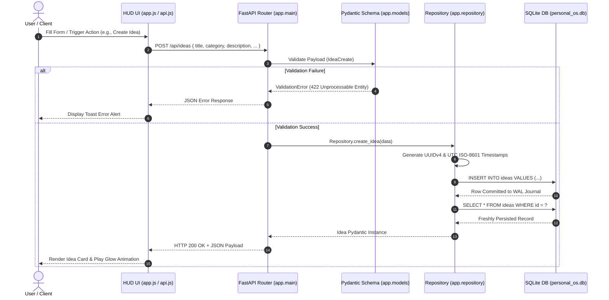
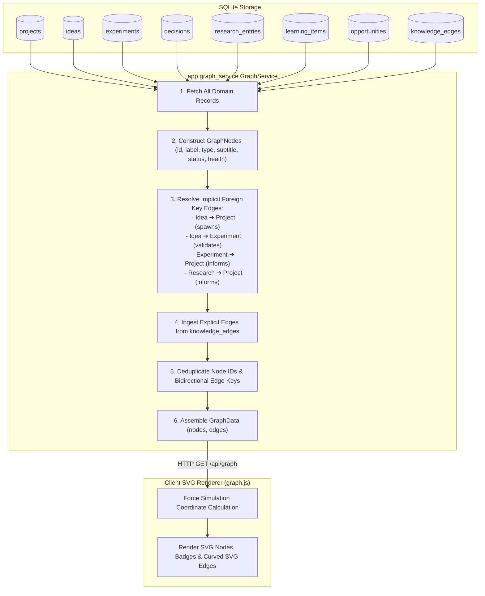
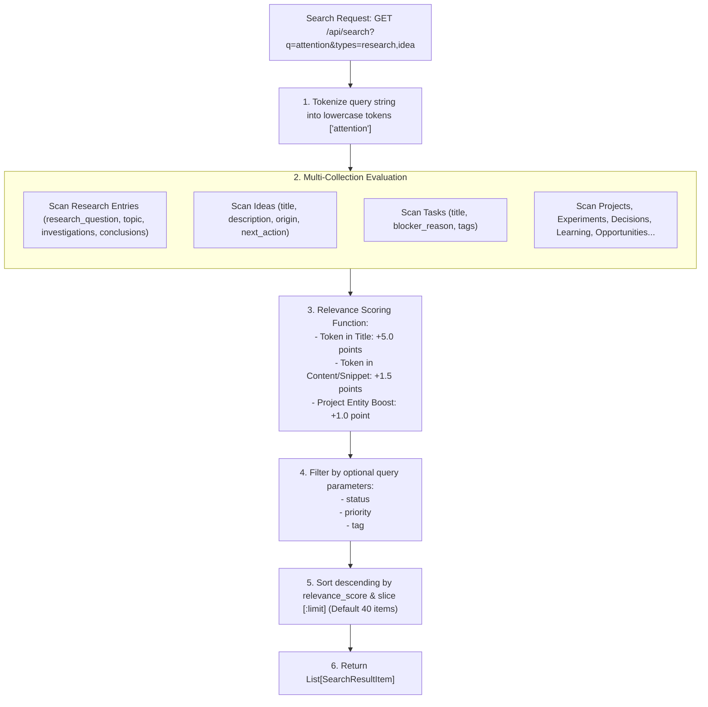
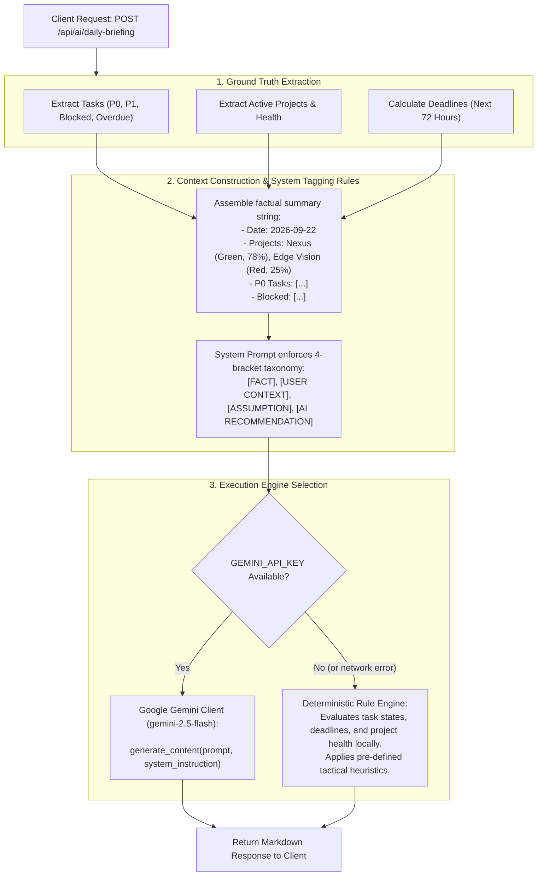

# Data Flow Architecture Specification

This document details the data lifecycle, transformation pipelines, and data flow architectures within the **Personal Command Center**.

---

## 1. Entity Mutation & Persistence Pipeline

Every state change across the 9 primary domain entities follows a strict unidirectional pipeline ensuring schema validation, relational consistency, and immediate durability:

---

## 2. Knowledge Graph Aggregation Pipeline

The Knowledge Graph combines implicit relational links derived from foreign keys with explicit user-defined relationships into a unified graph topology:

---

## 3. Universal Omni-Search Data Flow

The search pipeline evaluates text queries across all 8 domain entity collections using an in-memory token scoring algorithm:

---

## 4. Grounded AI Intelligence Pipeline

The AI pipeline guarantees truth preservation by separating verified repository data from generative recommendations:

