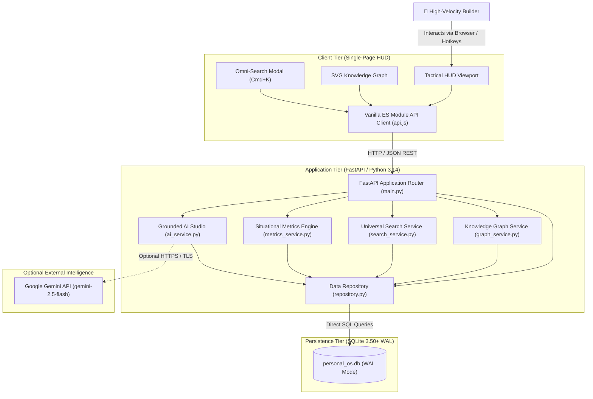

# Architecture Overview & Principles

This directory documents the structural, behavioral, and operational architecture of the **Personal Command Center**.

---

## 1. Architectural Philosophy

The Personal Command Center is designed around four foundational architectural tenets:

1. **Local Sovereignty (Zero Cloud Lock-in):**
   - All core operational data is maintained locally in a single embedded SQLite database (`personal_os.db`).
   - The system functions with 100% feature availability in completely offline environments.
   - External LLM APIs (Google Gemini) are strictly additive; if network connectivity or API credentials are unavailable, the engine falls back deterministically to local heuristic analysis.

2. **Sub-Millisecond Read Performance:**
   - SQLite is configured in Write-Ahead Logging (`WAL`) mode with persistent read connections and indexed foreign keys.
   - Average local API latency across CRUD endpoints is sub-millisecond, allowing the Single-Page HUD to provide an instantaneous, responsive experience.

3. **Cognitive Grounding over Generative Hallucination:**
   - In standard generative AI applications, models silently fabricate dates, tasks, and state.
   - Personal Command Center treats the database as the sole source of truth. All synthesized AI outputs strictly delineate verified database facts from inferred recommendations using an explicit 4-bracket taxonomy.

4. **Bi-Directional Relational Knowledge Graph:**
   - Unconnected notes decay. The architecture enforces relational links:
     `Idea ➔ Experiment ➔ Decision ➔ Project ➔ Tasks`
   - Explicit edges (`knowledge_edges`) and implicit entity relationships form an interactive knowledge mesh traversed dynamically by the graph service.

---

## 2. Architecture Documentation Suite

- **[System Architecture](system-architecture.md):** High-level topology, boundary definitions, protocol tiers, and environment context.
- **[Component Architecture](component-architecture.md):** Detailed breakdown of backend services, repository layers, and frontend visual modules.
- **[Data Flow Architecture](data-flow.md):** Ingestion pipelines, database mutations, search indexing, and graph aggregation.
- **[Runtime Flows & Sequences](runtime-flows.md):** Formal Mermaid sequence diagrams covering Daily Briefings, Omni-Search, Quick Capture, and Seeding.

---

## 3. High-Level System Diagram

