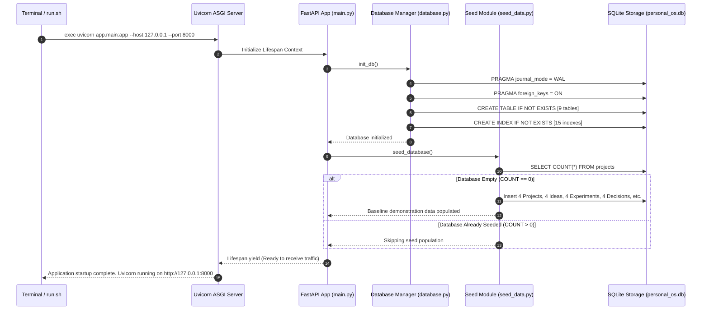
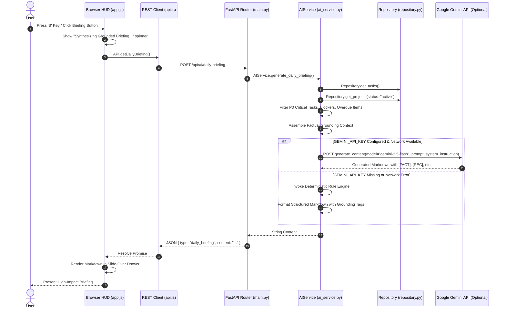
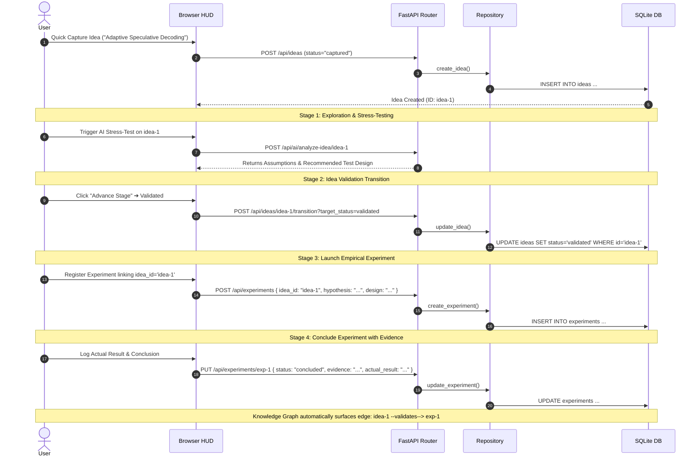

# Runtime Execution Flows & Sequences

This document illustrates the primary runtime execution sequences of the **Personal Command Center**.

---

## 1. Application Startup & Initialization Flow

Upon server launch, FastAPI's `@asynccontextmanager lifespan` coordinates database schema verification and seed population:

---

## 2. Tactical Daily Briefing Runtime Sequence

Triggered either by clicking the "Daily Briefing" HUD button or pressing the keyboard hotkey `B`:

---

## 3. Idea-to-Experiment Lifecycle Flow

Illustrates how an embryonic thought matures into empirical science:

