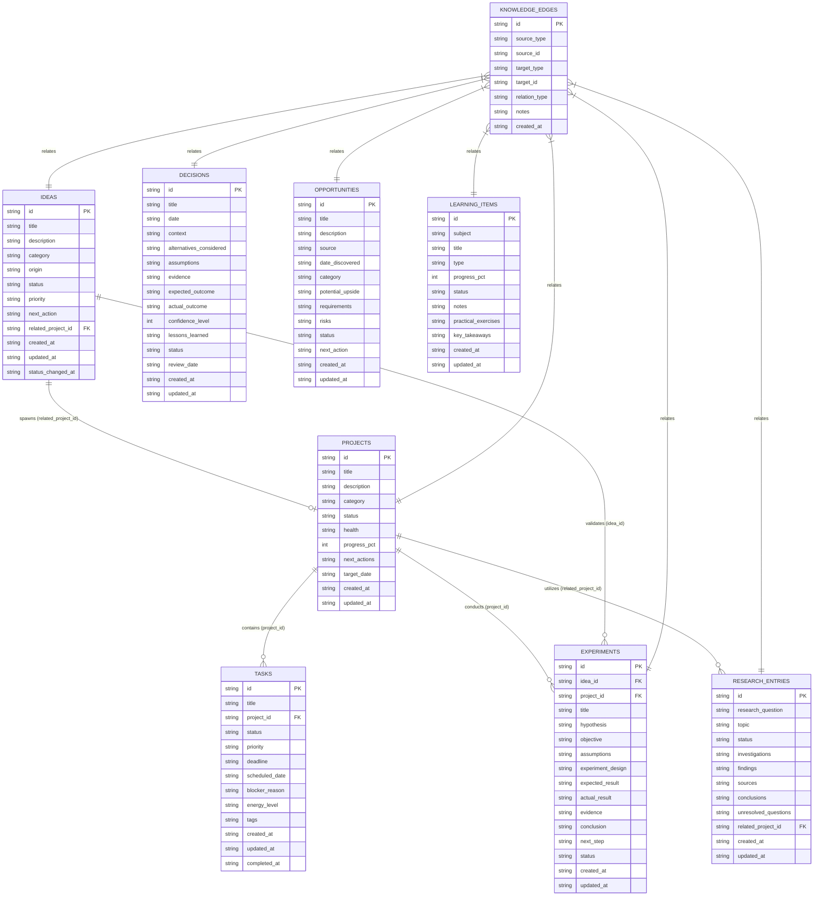

# Relational Database Schema Specification

This document details the relational tables, constraints, foreign keys, and indexes implemented in `app/database.py`.

---

## 1. Entity-Relationship Diagram (ERD)



---

## 2. Table Specifications

### 2.1 `tasks` Table
| Column Name | SQL Type | Constraints | Default | Notes |
|---|---|---|---|---|
| `id` | `TEXT` | `PRIMARY KEY` | — | UUIDv4 string |
| `title` | `TEXT` | `NOT NULL` | — | Task commitment description |
| `project_id` | `TEXT` | `REFERENCES projects(id) ON DELETE SET NULL` | `NULL` | Associated project ID |
| `status` | `TEXT` | `NOT NULL` | `'todo'` | `todo`, `in_progress`, `blocked`, `completed` |
| `priority` | `TEXT` | `NOT NULL` | `'p2_medium'` | `p0_critical`, `p1_high`, `p2_medium`, `p3_low` |
| `deadline` | `TEXT` | `NULL` | `NULL` | ISO-8601 Datetime string |
| `scheduled_date`| `TEXT` | `NULL` | `NULL` | ISO-8601 Date string |
| `blocker_reason`| `TEXT` | `NULL` | `NULL` | Reason if status is `blocked` |
| `energy_level` | `TEXT` | `NULL` | `'deep_work'` | `deep_work`, `quick_win`, `administrative` |
| `tags` | `TEXT` | `NULL` | `'[]'` | JSON array of strings |
| `created_at` | `TEXT` | `NOT NULL` | — | ISO-8601 UTC timestamp |
| `updated_at` | `TEXT` | `NOT NULL` | — | ISO-8601 UTC timestamp |
| `completed_at` | `TEXT` | `NULL` | `NULL` | Timestamp set upon completion |

### 2.2 `projects` Table
| Column Name | SQL Type | Constraints | Default | Notes |
|---|---|---|---|---|
| `id` | `TEXT` | `PRIMARY KEY` | — | UUIDv4 string |
| `title` | `TEXT` | `NOT NULL` | — | Project title |
| `description` | `TEXT` | `NULL` | `NULL` | Project scope / rationale |
| `category` | `TEXT` | `NOT NULL` | `'ai_systems'` | `ai_systems`, `research`, `product`, `career`, `infrastructure` |
| `status` | `TEXT` | `NOT NULL` | `'active'` | `active`, `planned`, `completed`, `blocked`, `maintenance` |
| `health` | `TEXT` | `NOT NULL` | `'green'` | `green`, `yellow`, `red` |
| `progress_pct` | `INTEGER`| `NOT NULL` | `0` | Range: `0` to `100` |
| `next_actions` | `TEXT` | `NULL` | `'[]'` | JSON array of strings |
| `target_date` | `TEXT` | `NULL` | `NULL` | Target completion date |
| `created_at` | `TEXT` | `NOT NULL` | — | ISO-8601 UTC timestamp |
| `updated_at` | `TEXT` | `NOT NULL` | — | ISO-8601 UTC timestamp |

### 2.3 `ideas` Table
| Column Name | SQL Type | Constraints | Default | Notes |
|---|---|---|---|---|
| `id` | `TEXT` | `PRIMARY KEY` | — | UUIDv4 string |
| `title` | `TEXT` | `NOT NULL` | — | Idea concept |
| `description` | `TEXT` | `NULL` | `NULL` | Detailed premise |
| `category` | `TEXT` | `NOT NULL` | `'software'` | `software`, `research`, `venture`, `content`, `personal` |
| `origin` | `TEXT` | `NULL` | `NULL` | Triggering insight or reference |
| `status` | `TEXT` | `NOT NULL` | `'captured'` | 7-stage state machine status |
| `priority` | `TEXT` | `NOT NULL` | `'medium'` | `high`, `medium`, `low` |
| `next_action` | `TEXT` | `NULL` | `NULL` | Immediate next validation step |
| `related_project_id` | `TEXT` | `REFERENCES projects(id) ON DELETE SET NULL` | `NULL` | Project spawned by idea |
| `created_at` | `TEXT` | `NOT NULL` | — | ISO-8601 UTC timestamp |
| `updated_at` | `TEXT` | `NOT NULL` | — | ISO-8601 UTC timestamp |
| `status_changed_at` | `TEXT` | `NOT NULL` | — | Timestamp of last stage transition |

### 2.4 `experiments` Table
| Column Name | SQL Type | Constraints | Default | Notes |
|---|---|---|---|---|
| `id` | `TEXT` | `PRIMARY KEY` | — | UUIDv4 string |
| `idea_id` | `TEXT` | `REFERENCES ideas(id) ON DELETE SET NULL` | `NULL` | Source idea tested |
| `project_id` | `TEXT` | `REFERENCES projects(id) ON DELETE SET NULL` | `NULL` | Target project informed |
| `title` | `TEXT` | `NOT NULL` | — | Experiment title |
| `hypothesis` | `TEXT` | `NOT NULL` | — | Falsifiable test proposition |
| `objective` | `TEXT` | `NOT NULL` | — | Empirical benchmark target |
| `assumptions` | `TEXT` | `NULL` | `'[]'` | JSON array of unverified assumptions |
| `experiment_design` | `TEXT` | `NOT NULL` | — | Procedure & methodology |
| `expected_result` | `TEXT` | `NOT NULL` | — | Predicted outcome |
| `actual_result` | `TEXT` | `NULL` | `NULL` | Empirical observations |
| `evidence` | `TEXT` | `NULL` | `NULL` | Links to logs, data, or charts |
| `conclusion` | `TEXT` | `NULL` | `NULL` | Analysis outcome |
| `next_step` | `TEXT` | `NULL` | `NULL` | Follow-up action |
| `status` | `TEXT` | `NOT NULL` | `'hypothesis'`| `hypothesis`, `design`, `running`, `analyzing`, `concluded`, `aborted` |
| `created_at` | `TEXT` | `NOT NULL` | — | ISO-8601 UTC timestamp |
| `updated_at` | `TEXT` | `NOT NULL` | — | ISO-8601 UTC timestamp |

### 2.5 `decisions` Table
| Column Name | SQL Type | Constraints | Default | Notes |
|---|---|---|---|---|
| `id` | `TEXT` | `PRIMARY KEY` | — | UUIDv4 string |
| `title` | `TEXT` | `NOT NULL` | — | Core decision reached |
| `date` | `TEXT` | `NOT NULL` | — | Decision execution date |
| `context` | `TEXT` | `NOT NULL` | — | Background and constraints |
| `alternatives_considered` | `TEXT` | `NULL` | `'[]'` | JSON array of `{option, pros, cons}` |
| `assumptions` | `TEXT` | `NOT NULL` | — | Working assumptions |
| `evidence` | `TEXT` | `NOT NULL` | — | Benchmarks / rationale |
| `expected_outcome` | `TEXT` | `NOT NULL` | — | Expected effect |
| `actual_outcome` | `TEXT` | `NULL` | `NULL` | Retrospective reality |
| `confidence_level` | `INTEGER`| `NOT NULL` | `75` | Range: `1` to `100` |
| `lessons_learned` | `TEXT` | `NULL` | `NULL` | Meta-heuristics extracted |
| `status` | `TEXT` | `NOT NULL` | `'pending_review'` | `pending_review`, `reviewed`, `superseded` |
| `review_date` | `TEXT` | `NULL` | `NULL` | Target date for calibration review |
| `created_at` | `TEXT` | `NOT NULL` | — | ISO-8601 UTC timestamp |
| `updated_at` | `TEXT` | `NOT NULL` | — | ISO-8601 UTC timestamp |

### 2.6 `research_entries` Table
| Column Name | SQL Type | Constraints | Default | Notes |
|---|---|---|---|---|
| `id` | `TEXT` | `PRIMARY KEY` | — | UUIDv4 string |
| `research_question` | `TEXT` | `NOT NULL` | — | Core inquiry investigated |
| `topic` | `TEXT` | `NOT NULL` | — | Domain topic string |
| `status` | `TEXT` | `NOT NULL` | `'exploring'` | `exploring`, `synthesizing`, `concluded`, `dormant` |
| `investigations` | `TEXT` | `NULL` | `NULL` | Notes on technical exploration |
| `findings` | `TEXT` | `NULL` | `'[]'` | JSON array of `{claim, evidence, confidence}` |
| `sources` | `TEXT` | `NULL` | `'[]'` | JSON array of `{title, url_or_citation, type}` |
| `conclusions` | `TEXT` | `NULL` | `NULL` | Synthesis conclusions |
| `unresolved_questions` | `TEXT` | `NULL` | `'[]'` | JSON array of open questions |
| `related_project_id` | `TEXT` | `REFERENCES projects(id) ON DELETE SET NULL` | `NULL` | Project supported |
| `created_at` | `TEXT` | `NOT NULL` | — | ISO-8601 UTC timestamp |
| `updated_at` | `TEXT` | `NOT NULL` | — | ISO-8601 UTC timestamp |

### 2.7 `learning_items` Table
| Column Name | SQL Type | Constraints | Default | Notes |
|---|---|---|---|---|
| `id` | `TEXT` | `PRIMARY KEY` | — | UUIDv4 string |
| `subject` | `TEXT` | `NOT NULL` | — | Curriculum subject area |
| `title` | `TEXT` | `NOT NULL` | — | Book, course, or paper title |
| `type` | `TEXT` | `NOT NULL` | `'book'` | `book`, `course`, `paper`, `tutorial`, `topic` |
| `progress_pct` | `INTEGER`| `NOT NULL` | `0` | Range: `0` to `100` |
| `status` | `TEXT` | `NOT NULL` | `'active'` | `queued`, `active`, `paused`, `completed` |
| `notes` | `TEXT` | `NULL` | `NULL` | Study notes |
| `practical_exercises` | `TEXT` | `NULL` | `'[]'` | JSON array of `{title, completed}` |
| `key_takeaways` | `TEXT` | `NULL` | `NULL` | Summarized learnings |
| `created_at` | `TEXT` | `NOT NULL` | — | ISO-8601 UTC timestamp |
| `updated_at` | `TEXT` | `NOT NULL` | — | ISO-8601 UTC timestamp |

### 2.8 `opportunities` Table
| Column Name | SQL Type | Constraints | Default | Notes |
|---|---|---|---|---|
| `id` | `TEXT` | `PRIMARY KEY` | — | UUIDv4 string |
| `title` | `TEXT` | `NOT NULL` | — | Opportunity title |
| `description` | `TEXT` | `NULL` | `NULL` | Overview |
| `source` | `TEXT` | `NULL` | `NULL` | Discovery channel |
| `date_discovered` | `TEXT` | `NOT NULL` | — | ISO-8601 Date string |
| `category` | `TEXT` | `NOT NULL` | — | `technology`, `career`, `business`, `entrepreneurship`, etc. |
| `potential_upside` | `TEXT` | `NULL` | `NULL` | Expected value/gain |
| `requirements` | `TEXT` | `NULL` | `NULL` | Capital / skill prerequisite |
| `risks` | `TEXT` | `NULL` | `NULL` | Downside considerations |
| `status` | `TEXT` | `NOT NULL` | `'evaluating'` | `evaluating`, `pursuing`, `watching`, `archived` |
| `next_action` | `TEXT` | `NULL` | `NULL` | Action to capture upside |
| `created_at` | `TEXT` | `NOT NULL` | — | ISO-8601 UTC timestamp |
| `updated_at` | `TEXT` | `NOT NULL` | — | ISO-8601 UTC timestamp |

### 2.9 `knowledge_edges` Table
| Column Name | SQL Type | Constraints | Default | Notes |
|---|---|---|---|---|
| `id` | `TEXT` | `PRIMARY KEY` | — | UUIDv4 string |
| `source_type` | `TEXT` | `NOT NULL` | — | Entity type of source node |
| `source_id` | `TEXT` | `NOT NULL` | — | UUID of source node |
| `target_type` | `TEXT` | `NOT NULL` | — | Entity type of target node |
| `target_id` | `TEXT` | `NOT NULL` | — | UUID of target node |
| `relation_type` | `TEXT` | `NOT NULL` | — | `leads_to`, `validates`, `informs`, `implements`, `spawns`, `depends_on`, `references` |
| `notes` | `TEXT` | `NULL` | `NULL` | Annotation on relationship |
| `created_at` | `TEXT` | `NOT NULL` | — | ISO-8601 UTC timestamp |

---

## 3. Database Indexes

The schema creates 15 dedicated indexes to accelerate tactical dashboard lookups and full graph traversals:

```sql
-- Tasks indexes
CREATE INDEX idx_tasks_status ON tasks(status);
CREATE INDEX idx_tasks_priority ON tasks(priority);
CREATE INDEX idx_tasks_deadline ON tasks(deadline);
CREATE INDEX idx_tasks_project ON tasks(project_id);

-- Projects indexes
CREATE INDEX idx_projects_status ON projects(status);
CREATE INDEX idx_projects_health ON projects(health);

-- Ideas indexes
CREATE INDEX idx_ideas_status ON ideas(status);
CREATE INDEX idx_ideas_priority ON ideas(priority);

-- Experiments indexes
CREATE INDEX idx_experiments_status ON experiments(status);

-- Decisions indexes
CREATE INDEX idx_decisions_status ON decisions(status);
CREATE INDEX idx_decisions_review_date ON decisions(review_date);

-- Research indexes
CREATE INDEX idx_research_status ON research_entries(status);
CREATE INDEX idx_research_topic ON research_entries(topic);

-- Learning indexes
CREATE INDEX idx_learning_status ON learning_items(status);

-- Opportunities indexes
CREATE INDEX idx_opportunities_status ON opportunities(status);
CREATE INDEX idx_opportunities_category ON opportunities(category);

-- Knowledge edges indexes
CREATE INDEX idx_edges_source ON knowledge_edges(source_type, source_id);
CREATE INDEX idx_edges_target ON knowledge_edges(target_type, target_id);
```
