# Deployment Architecture & Operations Guide

This document details the production deployment models, runtime daemonization, containerization blueprints, and persistent storage management for the **Personal Command Center**.

---

## 1. Deployment Models

The Personal Command Center supports three deployment topologies based on operational requirements:

```mermaid
graph TD
    subgraph Model1 ["Model 1: Local Standalone (Default)"]
        User["Builder Terminal"] -->|./run.sh| Uvicorn1["Uvicorn ASGI (Foreground)"]
        Uvicorn1 --> DB1[("Local SQLite DB")]
    end

    subgraph Model2 ["Model 2: Background OS Daemon (macOS / Linux)"]
        OS["systemd / launchd"] -->|Keep-Alive Daemon| Uvicorn2["Uvicorn Background Service"]
        Uvicorn2 --> DB2[("Persistent SQLite DB")]
    end

    subgraph Model3 ["Model 3: Containerized Microservice"]
        Docker["Docker Engine / Compose"] -->|Exposed Port 8000| Container["App Container"]
        Container --> Volume[("Mounted Volume /data")]
    end
```



---

## 2. Model 1: Local Standalone Process (Standard)

The primary operating pattern is a standalone Python process running on the host machine:

```bash
# Execute startup script
./run.sh

# Or using Make
make run PORT=8000
```

- **Process Supervisor:** Foreground shell process.
- **Port Binding:** `127.0.0.1:8000` (loopback only).
- **Auto-Reload:** Enabled by default in `run.sh` via `--reload` flag for seamless local iterations.

---

## 3. Model 2: Background OS Service (macOS launchd)

To run Personal Command Center as an automatic background service on macOS that starts on login:

Create `~/Library/LaunchAgents/com.user.personal-command-center.plist`:

```xml
<?xml version="1.0" encoding="UTF-8"?>
<!DOCTYPE plist PUBLIC "-//Apple//DTD PLIST 1.0//EN" "http://www.apple.com/DTDs/PropertyList-1.0.dtd">
<plist version="1.0">
<dict>
    <key>Label</key>
    <string>com.user.personal-command-center</string>
    <key>ProgramArguments</key>
    <array>
        <string>/Users/dammy/Documents/GitHub/personal-command-center/.venv/bin/python</string>
        <string>-m</string>
        <string>uvicorn</string>
        <string>app.main:app</string>
        <string>--host</string>
        <string>127.0.0.1</string>
        <string>--port</string>
        <string>8000</string>
    </array>
    <key>WorkingDirectory</key>
    <string>/Users/dammy/Documents/GitHub/personal-command-center</string>
    <key>RunAtLoad</key>
    <true/>
    <key>KeepAlive</key>
    <true/>
    <key>StandardOutPath</key>
    <string>/Users/dammy/Library/Logs/personal-command-center.log</string>
    <key>StandardErrorPath</key>
    <string>/Users/dammy/Library/Logs/personal-command-center-err.log</string>
</dict>
</plist>
```

Load the service:
```bash
launchctl load ~/Library/LaunchAgents/com.user.personal-command-center.plist
```

---

## 4. Model 3: Containerization Blueprint (Docker)

For isolated container deployments:

### 4.1 Dockerfile Blueprint
```dockerfile
FROM python:3.14-slim

ENV PYTHONUNBUFFERED=1 \
    PYTHONDONTWRITEBYTECODE=1 \
    COMMAND_CENTER_DB=/data/personal_os.db \
    HOST=0.0.0.0 \
    PORT=8000

WORKDIR /app

RUN apt-get update && apt-get install -y --no-install-recommends \
    curl sqlite3 \
    && rm -rf /var/lib/apt/lists/*

COPY requirements.txt .
RUN pip install --no-cache-dir -r requirements.txt

COPY app/ ./app/
COPY static/ ./static/

# Mount volume for persistent SQLite database
VOLUME ["/data"]

EXPOSE 8000

HEALTHCHECK --interval=30s --timeout=5s --start-period=5s --retries=3 \
  CMD curl -f http://localhost:8000/api/health || exit 1

CMD ["python", "-m", "uvicorn", "app.main:app", "--host", "0.0.0.0", "--port", "8000"]
```

### 4.2 Docker Compose Blueprint
```yaml
version: '3.8'

services:
  command-center:
    build: .
    container_name: personal-command-center
    restart: unless-stopped
    ports:
      - "127.0.0.1:8000:8000"
    environment:
      - GEMINI_API_KEY=${GEMINI_API_KEY:-}
    volumes:
      - ./data:/data
```

---

## 5. Persistent Storage & Backup Management

> [!IMPORTANT]
> The database requires persistence across container restarts or process reboots.
> When deploying in containers or virtual machines, ensure that the path defined in `COMMAND_CENTER_DB` (or the root directory containing `personal_os.db`) is mapped to a durable physical volume.

### Zero-Downtime Rollback Strategy
1. **Rollback Binary / Code:** Revert git commit (`git checkout <previous_stable_hash>`).
2. **Rollback Database:** Restore verified backup:
   ```bash
   sqlite3 personal_os.db ".restore 'backups/personal_os_backup_pre_deploy.db'"
   ```
3. **Restart Service:** Restart Uvicorn process.
