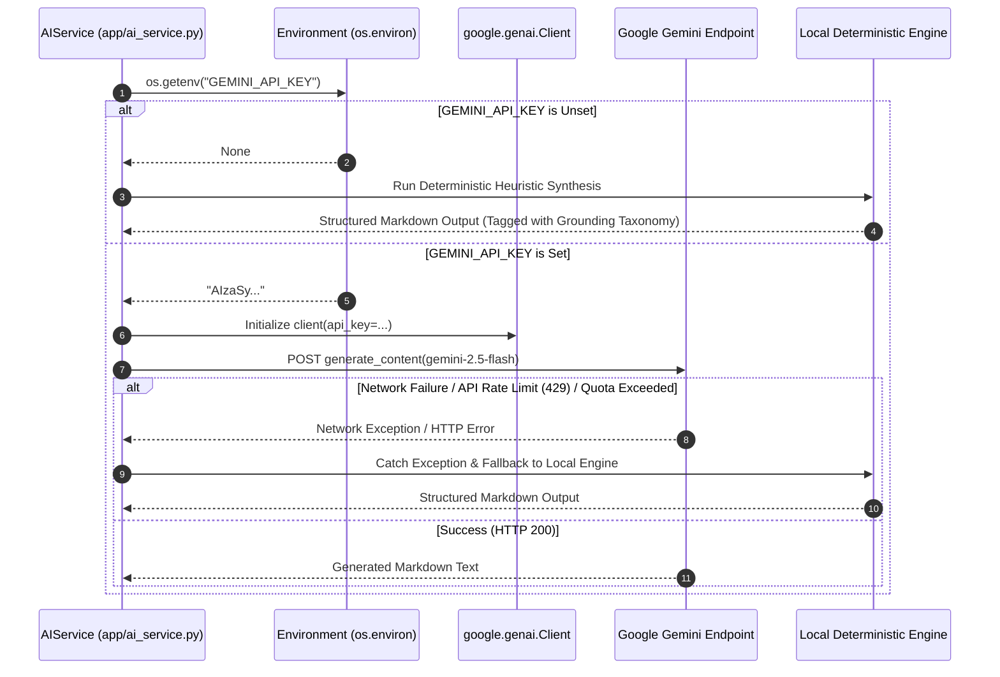

# External Integrations Specification

This document details the external system integrations, protocol bridges, and service dependencies of the **Personal Command Center**.

---

## 1. Integration Inventory

| External System | Integration Purpose | Communication Mechanism | Auth Method | Dependency Criticality |
|---|---|---|---|---|
| **Google Gemini API** | AI Studio intelligence synthesis (`gemini-2.5-flash`) | HTTPS / TLS 1.3 via `google-genai` SDK | Bearer Token (`GEMINI_API_KEY`) | **Optional / Non-blocking** |
| **Model Context Protocol (MCP)** | Agentic tool exposure to Claude / Antigravity | Standard I/O / SSE JSON-RPC | Local Process IPC | **Roadmap (v1.1+)** |
| **External Web Citations** | Academic and industry source references | Passive URL storing in JSON columns | N/A (Client click-through) | Informational |

---

## 2. Google Gemini Generative AI Integration

### 2.1 Architectural Role
The Personal Command Center integrates with Google Gemini to amplify the user's situational posture with automated daily briefings, project diagnostics, idea stress-testing, and decision retrospectives.

### 2.2 Client Implementation
- **SDK:** `google-genai >= 2.0.0`
- **Target Model:** `gemini-2.5-flash`
- **Code Reference:** `app/ai_service.py` (`AIService._call_gemini_if_available`)

```python
def _call_gemini_if_available(prompt: str, system_instruction: str) -> Optional[str]:
    if not GEMINI_API_KEY:
        return None
    try:
        from google import genai
        client = genai.Client(api_key=GEMINI_API_KEY)
        response = client.models.generate_content(
            model="gemini-2.5-flash",
            contents=prompt,
            config={"system_instruction": system_instruction}
        )
        if response and response.text:
            return response.text
    except Exception:
        return None
    return None
```

### 2.3 Failure & Offline Resilience Pattern



### 2.4 Operational Considerations
1. **Zero Cold-Start Latency:** When offline or unkeyed, responses return in under 5 milliseconds.
2. **Predictable Cost Envelope:** Gemini 2.5 Flash token consumption is low (<1,500 tokens per daily briefing).
3. **Strict Truth Boundaries:** Even when calling external models, the system prompt strictly forces the model into the 4-bracket taxonomy: `[FACT]`, `[USER CONTEXT]`, `[ASSUMPTION]`, `[AI RECOMMENDATION]`.

---

## 3. Roadmap Integrations (Planned v1.1 - v1.2)

### 3.1 Model Context Protocol (MCP) Server
- **Objective:** Enable autonomous AI coding assistants (such as Antigravity, Claude Code, or Cursor) to read and write to the personal command center directly during development sessions.
- **Exposed Tools:**
  - `list_active_tasks(project_id)`
  - `register_research_finding(topic, claim, evidence)`
  - `log_decision(title, context, assumptions, confidence)`
- **Transport:** Standard input/output (`stdio`) JSON-RPC.
