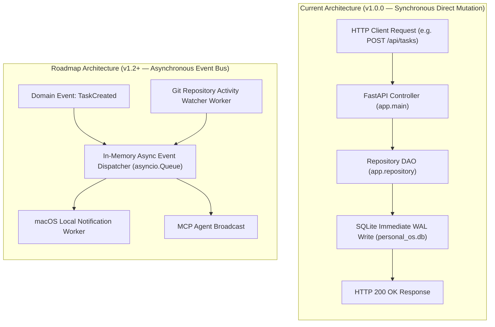

# Messaging & Event Architecture

This document clarifies the event handling mechanisms, concurrency semantics, and messaging architecture of the **Personal Command Center**.

---

## 1. Architectural Reality Assessment

> [!NOTE]
> **Established Codebase Finding:**  
> The Personal Command Center operates as a **synchronous, in-process request-response application**. There are **no external message brokers** (such as Apache Kafka, RabbitMQ, Celery, or Redis Pub/Sub) present in the repository.

All entity mutations, state transitions, and search index scans are processed synchronously within the HTTP thread pool managed by Uvicorn and FastAPI.

---

## 2. In-Process Event Handling

While there is no external broker, the application utilizes structured in-process lifecycle events:

### 2.1 Application Lifespan Events
Managed via FastAPI's `@asynccontextmanager` in `app/main.py`:

```python
@asynccontextmanager
async def lifespan(app: FastAPI):
    # Startup Event Hook
    init_db()
    seed_database()
    yield
    # Shutdown Event Hook (Graceful connection teardown)
```

1. **Startup Event:**
   - Triggers `init_db()` to run DDL and verify table/index integrity.
   - Triggers `seed_database()` to populate baseline domain entities if empty.
2. **Shutdown Event:**
   - Flushes unwritten WAL pages and terminates active database connections cleanly.

---

## 3. Synchronous Execution Flow vs. Future Event Roadmap



---

## 4. Concurrency & Delivery Semantics

| Property | Implementation Mechanism | Evidence Source |
|---|---|---|
| **Delivery Guarantee** | At-least-once local transaction | SQLite ACID WAL commits |
| **Ordering** | Strict serial order per connection | Single-threaded SQLite write locks |
| **Idempotency** | UUIDv4 primary keys prevent duplicate inserts | Primary key constraints on all tables |
| **Concurrency Gate** | `PRAGMA busy_timeout = 5000;` | Connection factory in `app/database.py` |
| **Dead-Letter Handling** | N/A (Direct HTTP error response returned to caller) | Handled by FastAPI exception handlers |
